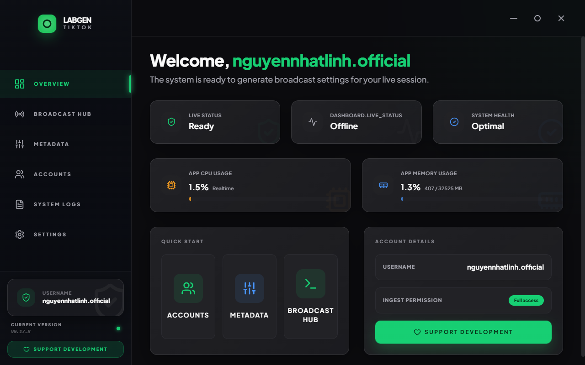
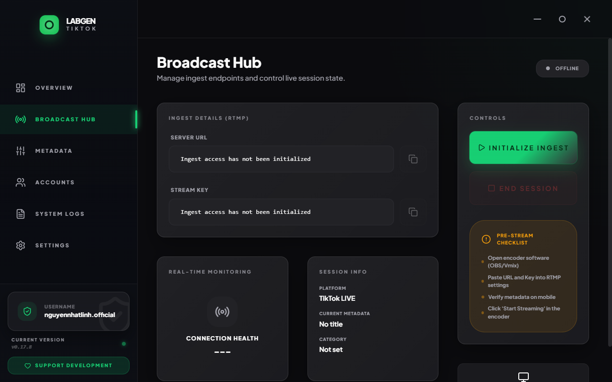
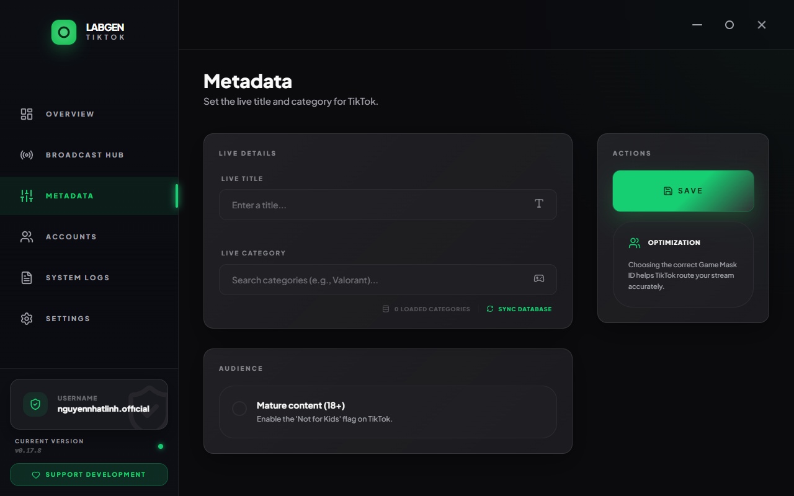
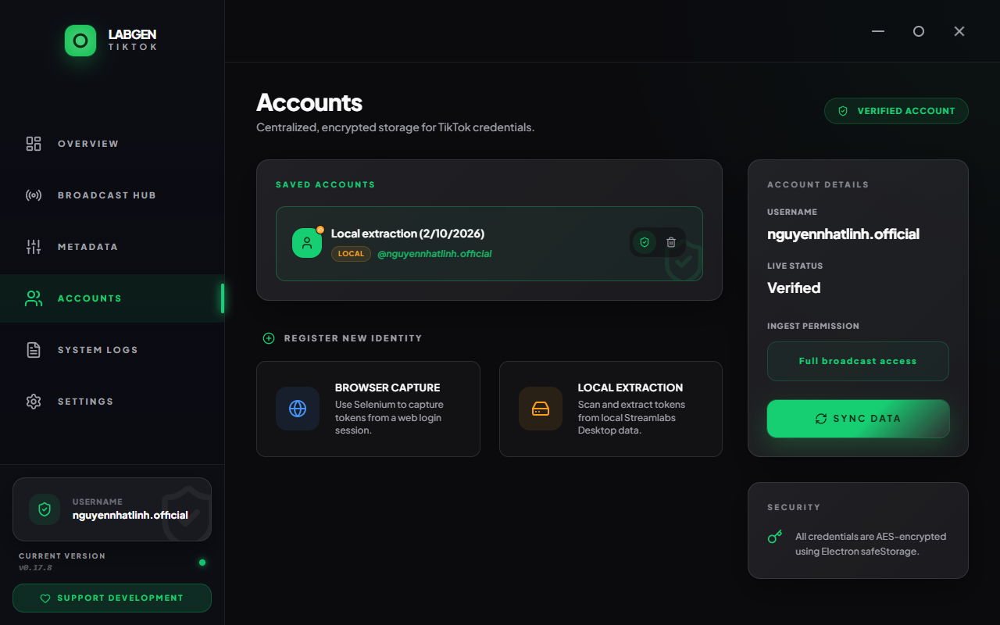
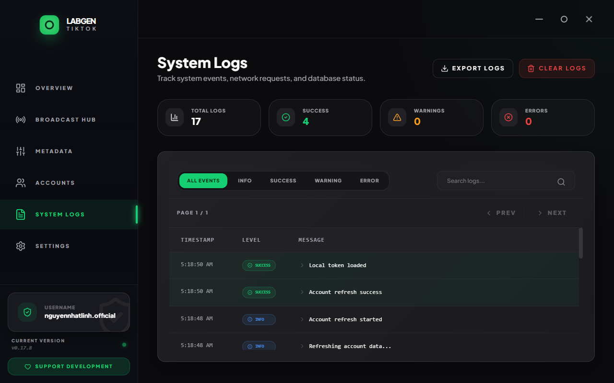
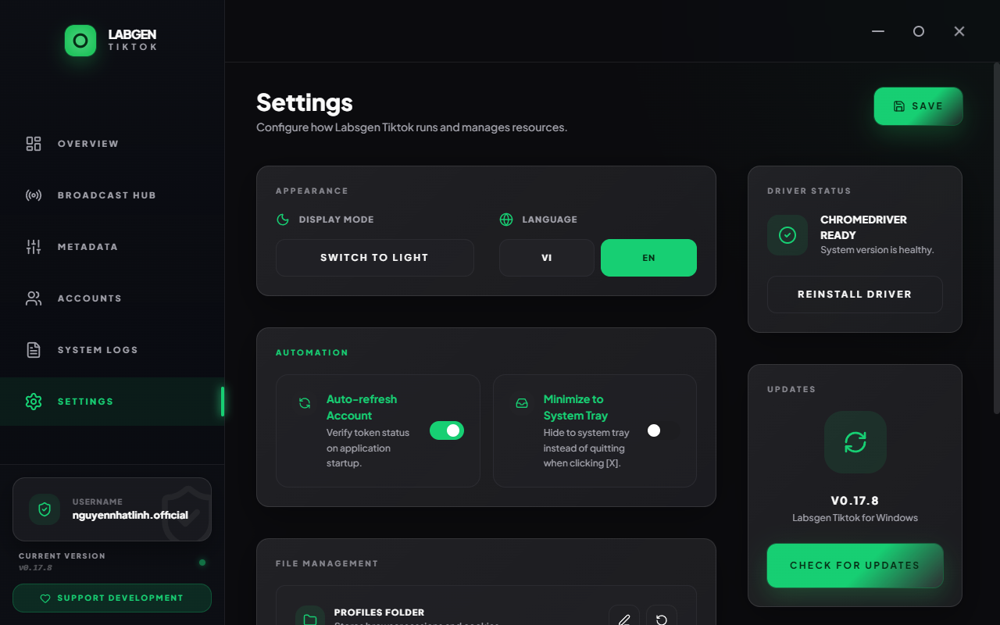

# Labsgen Tiktok - TikTok Live Stream Key Generator

<div align="center">
  
  <p><strong>TikTok Live Stream Key Generator for OBS from Streamlabs</strong></p>
  <p><em>Labsgen Tiktok is a Windows TikTok Live Stream Key Generator that helps creators fetch RTMP URL and Stream Key for OBS quickly and safely.</em></p>
  <p>
    
    
    
    
  </p>
  <p>
    <a href="https://ko-fi.com/chokernguyen">
      
    </a>
  </p>
</div>

---

## 📖 Overview
**Labsgen Tiktok** is a Windows desktop tool that helps creators obtain **TikTok Live Stream Keys (RTMP URL + Stream Key)** from Streamlabs and use them in OBS or other encoders.

It centralizes the full live setup flow:
- Capture or import tokens safely (local extraction or browser-based capture).
- Manage multiple accounts in an encrypted vault.
- Configure metadata (title, category, audience).
- Initialize ingest and copy RTMP details quickly.

Under the hood, it uses **SQLite 3** for fast local storage, **Electron safeStorage** for encryption, and a clean edge-to-edge UI for an efficient streaming workflow.

## ✨ Key Features

*   🔑 **Identity Vault:** Multi-account management with OS-level AES-256 encryption. Supports automated browser token capture (Selenium) and local extraction.
*   🛰️ **Broadcast Hub:** Initialize and control live ingest endpoints in real time. UI optimized for copying RTMP URL and Stream Key.
*   📑 **Metadata Config:** Smart title and category setup with fast **Game Mask ID** matching from the internal SQLite cache.
*   🖥️ **Professional UI:** Modern edge-to-edge interface with high-contrast **Dark/Light Mode** and **Plus Jakarta Sans** typography.
*   🛡️ **Kernel Diagnostics:** Detailed kernel logs and monitoring of network and database status for reliable operations.
*   🤖 **Auto-Bootstrap:** Smart environment detection and automated ChromeDriver setup.

## 🖼️ Screenshots







## 🛠️ Core Stack

- **Core:** Electron v40+ (Windows optimized)
- **Frontend:** React 19, Tailwind CSS, Framer Motion
- **Database:** SQLite 3 (via `better-sqlite3`)
- **Security:** Windows safeStorage API
- **Automation:** Selenium WebDriver
- **Infrastructure:** electron-vite, electron-builder (NSIS MUI2)

## 🚀 Getting Started

### For Users

**System Requirements**
- Windows 10/11 (x64)
- Google Chrome (latest version)

**Download**
Get the latest installer from GitHub Releases:
```
https://github.com/antiantidev/labsgen-tiktok/releases
```

**Important Note**
This app is not code‑signed yet, so Windows SmartScreen may warn that it is unrecognized. You can still proceed if you trust the source (this repo).

### For Developers
```bash
# Clone the repository
git clone https://github.com/antiantidev/labsgen-tiktok.git

# Install dependencies
npm install

# Rebuild native modules (SQLite)
npx electron-rebuild -f -w better-sqlite3

# Start in Development mode
npm run dev
```

### Build for Release (Developers)
```bash
# Build a professional Windows installer (.exe)
npm run build
npx electron-builder --win nsis --x64
```

## 📄 License & Contact
Developed by **Nhat Linh Nguyen**.  
License: **MIT License**.

---
<div align="center">
  <p>Built with ❤️ for the Streamer</p>
</div>
