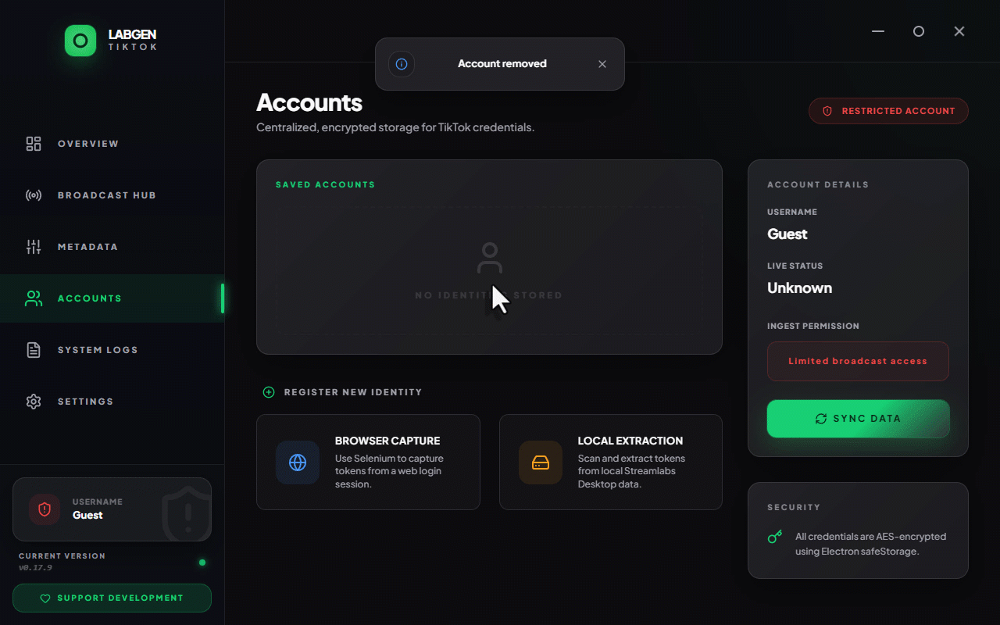
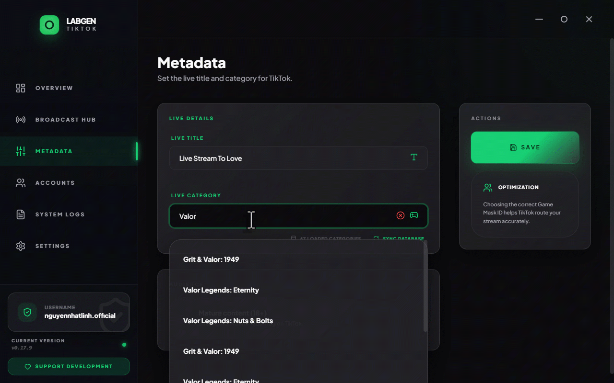
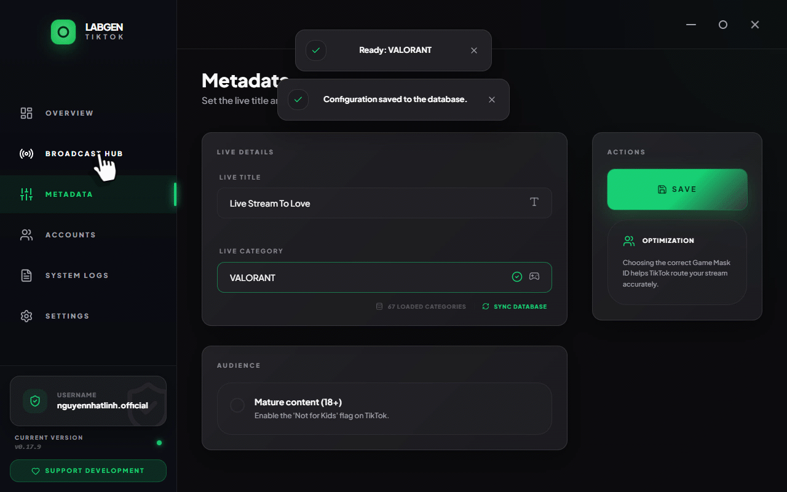
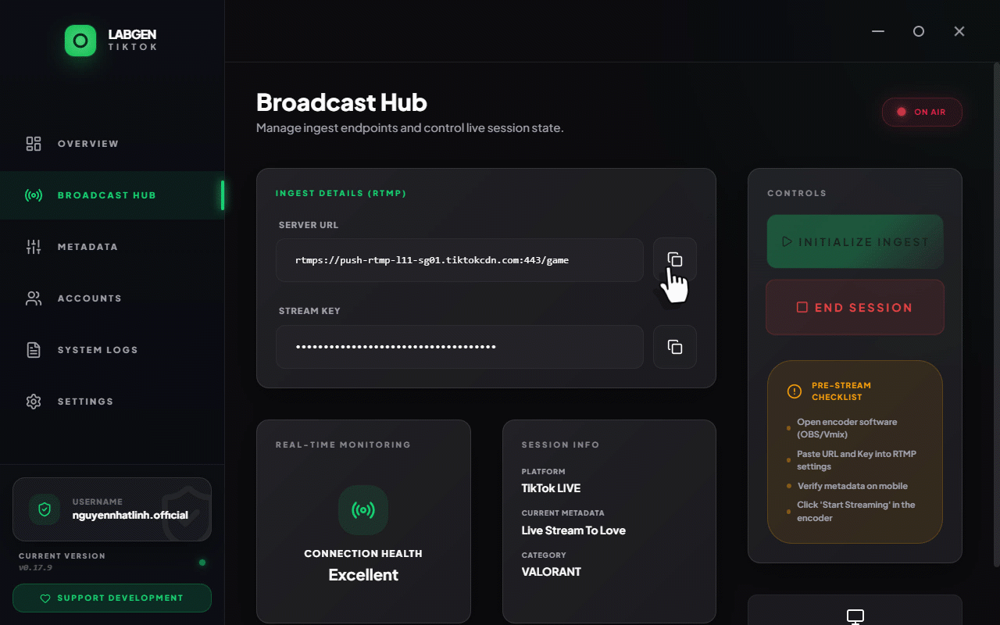

# Labsgen Tiktok - TikTok Live Stream Key Generator

<div align="center">
  
  <p><strong>TikTok Live Stream Key Generator for OBS from Streamlabs</strong></p>
  <p><em>Windows desktop app for fetching RTMP URL and Stream Key for OBS.</em></p>
  <p>
    
    
    
    
  </p>
  <p>
    <a href="https://ko-fi.com/chokernguyen">
      
    </a>
  </p>
</div>

---

## Overview

Labsgen Tiktok is a Windows desktop tool that helps creators obtain TikTok Live Stream Keys
(RTMP URL + Stream Key) from Streamlabs and use them in OBS or other encoders.

It centralizes the live setup flow:
- Capture or import tokens safely through local extraction or browser-based capture.
- Manage multiple accounts in an encrypted vault.
- Configure metadata such as title, category, and audience.
- Initialize ingest and copy RTMP details quickly.

Under the hood, it uses SQLite 3 for local storage, Electron safeStorage for encryption,
and an edge-to-edge UI for a fast streaming workflow. ChromeDriver is matched to the
installed Google Chrome version so browser capture stays in sync after Chrome updates.

## Key Features

- Identity Vault: Multi-account management with OS-level encryption. Supports automated browser token capture and local extraction.
- Broadcast Hub: Initialize and control live ingest endpoints in real time. UI optimized for copying RTMP URL and Stream Key.
- Metadata Config: Fast title and category setup with internal SQLite cache support.
- Professional UI: Modern edge-to-edge interface with dark and light modes.
- Kernel Diagnostics: Detailed logs and system monitoring for reliable operation.
- Auto-Bootstrap: Environment detection and automated ChromeDriver setup.

## Screenshots






## Core Stack

- Core: Electron v40+ (Windows optimized)
- Frontend: React 19, Tailwind CSS, Framer Motion
- Database: SQLite 3 via `better-sqlite3`
- Security: Windows safeStorage API
- Automation: Selenium WebDriver
- Infrastructure: electron-vite, electron-builder (NSIS)

## Refactor Status (v0.18.0)

This release includes a major architecture and tooling refactor:
- Migrated runtime app code from JavaScript to TypeScript (`src/main`, `src/preload`, `src/renderer`, and UI modules).
- Main process reorganized using a Clean Lite structure:
  - `src/main/core/*`: bootstrap, config, lifecycle, window, IPC helpers, shared main types.
  - `src/main/features/*`: feature-level IPC registrations (core, driver, logs, updates).
  - `src/main/services/*`: infrastructure services (stream, token, driver, sqlite, oauth, selenium, encryption).
- Replaced legacy dynamic service loading with static typed wiring in main bootstrap.
- Added reusable GitHub workflow validation (`validate.yml`) and standardized CI/release flow.
- Added collaboration standards:
  - `CONTRIBUTING.md`
  - PR template
  - Issue templates
  - CODEOWNERS
  - auto-label workflow (`labels.yml`)

For implementation details and migration notes, see:
- `docs/refactor-clean-lite-v0.18.0.md`
- `CHANGELOG.md`

## Documentation

Complete project docs are available in [`docs/README.md`](docs/README.md).

Core references:

- Architecture: [`docs/architecture.md`](docs/architecture.md)
- Development setup: [`docs/development.md`](docs/development.md)
- User operations: [`docs/user-guide.md`](docs/user-guide.md)
- IPC contract: [`docs/ipc-api.md`](docs/ipc-api.md)
- Data model and persistence: [`docs/data-storage.md`](docs/data-storage.md)
- Security notes: [`docs/security.md`](docs/security.md)
- Testing: [`docs/testing.md`](docs/testing.md)
- CI and release: [`docs/ci-release.md`](docs/ci-release.md)
- Troubleshooting: [`docs/troubleshooting.md`](docs/troubleshooting.md)

## Getting Started

### For Users

System requirements:
- Windows 10/11 (x64)
- Google Chrome (latest version)

Download the latest installer from GitHub Releases:

https://github.com/antiantidev/labsgen-tiktok/releases

Important note:
This app is not code-signed yet, so Windows SmartScreen may warn that it is unrecognized.
You can continue if you trust the source.

### For Developers

This repository uses `pnpm`.

Prerequisites:
- Node.js 22+ (recommended: latest LTS)
- Corepack enabled (`corepack enable`)

```bash
# Clone the repository
git clone https://github.com/antiantidev/labsgen-tiktok.git

# Install dependencies
pnpm install

# Start in development mode
pnpm dev

# Run TypeScript checks
pnpm typecheck

# Run tests
pnpm test
```

Notes:
- Native modules are rebuilt automatically during `pnpm install`.
- Browser capture will auto-detect installed Chrome and download a matching ChromeDriver.
- Contribution process and team conventions: see `CONTRIBUTING.md`.

### Build for Release

```bash
# Build the app bundles
pnpm build

# Build a Windows installer
pnpm exec electron-builder --win nsis --x64

# Build and publish a GitHub release
pnpm release
```

### CI and Release Workflows

GitHub Actions uses four workflows:
- `ci.yml`: runs on every push (except `v*` tags) and pull request.
- `validate.yml`: reusable workflow that runs install + typecheck + test (+ optional build).
- `release.yml`: runs on `v*` tags, calls `validate.yml`, validates tag/version, then publishes.
- `labels.yml`: syncs repository labels and auto-labels issues/PRs.
- `CODEOWNERS`: auto-requests reviewers by path ownership.

Release tag rule:
- Tag must match `package.json` version exactly, in the format `v<version>`.
- Example: if version is `0.18.0`, release tag must be `v0.18.0`.

Typical release flow:
```bash
# 1) bump version in package.json
# 2) commit changes
git add .
git commit -m "release: v0.18.0"

# 3) create and push release tag
git tag v0.18.0
git push origin main --tags
```

## License & Contact

Developed by Nhat Linh Nguyen.  
License: MIT License.

---

<div align="center">
  <p>Built with love for the streamer</p>
</div>
